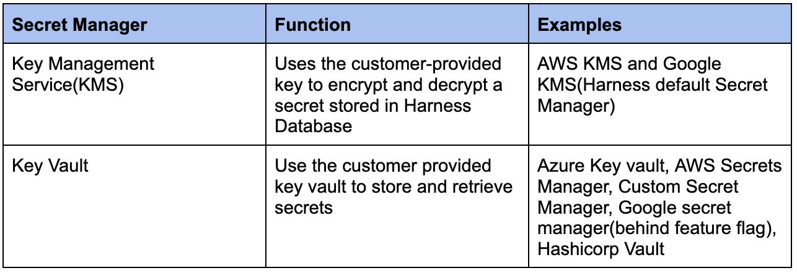
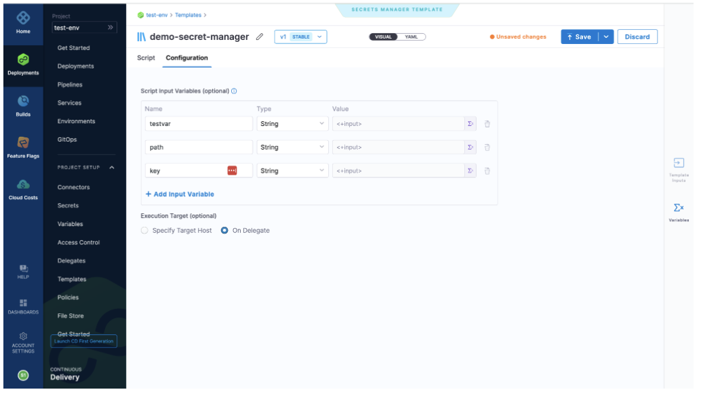

## Introduction to Harness Secrets

In this blog, let us understand Harness Secrets, how they are stored along with different scenarios, we can use secrets. 

### What are Harness Secrets and Secret Management?

**Harness Secrets**
Generally, secrets are credentials, passwords, config files or keys that you will need to deploy your software across different environments.

Harness stores secrets in the Secret Manager of your choice and secrets exist in 2 forms:
1. Text Secrets
2. File Secrets
 
Secrets and Secret Manager can be scoped to the app, environment type and environment or a delegate. User groups can be given access to read and manage Secrets and Secret Manager. You can reference the secrets in Harness connectors, scripts, commands, service specifications once they are added.

**Harness Secret Management**
Harness provides a built-in Secret Management to store the encrypted secrets and use them in Harness applications. Secrets are always encrypted when they are stored and decrypted when they are needed.

Moreover, you can view what secrets have been used across the application, who made the changes, and how it was used. It is the delegate in the client’s private network that can access the key management system and not the Harness Manager and is not publicly accessible.

Though we have multiple Secret Managers available at Harness, we can have only one **default secret** you can add all your secrets to.
 
### Secrets Manager

For further details on Harness Support platforms, methodologies and related technologies you can refer to the [documentation](https://docs.harness.io/article/1e536z41av-supported-platforms-and-technologies#sd_ks_installed_with_the_delegate) for Next-Gen modules.
 
### Let’s dive in!

**- Add a Secret Manager**

Let’s follow the steps!
Step 1: Once you sign up and on app.harness.io Next-Gen page, go to **Account Settings** -> **Organization** -> Create a **+New Organization** -> Create a **Project** -> Go to **Project Setup** -> **Connectors** -> Create **+New Connector** -> Select **Secret Managers** of your choice.

Step 2: Once you are in! Just fill in the account access information for the new Secret Manager. You can also select **Use as default Secret Manager** to store all the secrets.

Once the setup is ready, you will now be able to store the encrypted secrets of Cloud Provider/Connector secret fields. If a Secret Manager isn’t created, then by default Harness uses **Google Key Management System** to store the secret keys.

**-Add and Reference Text Secrets**
You can create and store [Text Secrets](https://docs.harness.io/article/osfw70e59c-add-use-text-secrets) in Secret Managers to use it across Pipelines and Connectors.

**-Add and Reference File Secrets**
Generally, in the pipeline steps, connectors or in other settings, we add secret text as credentials. Similarly, we can upload [encrypted files](https://docs.harness.io/article/77tfo7vtea-add-file-secrets) and use them.

**-Add a Custom Secret Manager**
Custom secrets are used for Secret Manager out of Harness listing, that is, a way to access encrypted secrets stored in third-party Secret Managers. Before we get started on how we create it, a feature flag: **CUSTOM_SECRET_MANAGER_NG** needs to be enabled. Custom Secret Manager is a read-only secret manager and you cannot **write** secrets but **read/decrypt** it. 

Let’s follow the steps!

Step 1: Go to Harness Account -> **Project** -> **Project Setup** -> Click **Templates** -> Click **+New Template** -> Click on **Secret Manager**.

This is how your custom **Secret Manager Template** looks like.
  
Enter your [script](https://docs.harness.io/article/n41cqkjrla-create-a-secret-manager-template), give a description if needed and click on **SAVE**.

Step 2: We have to configure input variables for the parameters defined in the script[*script basically makes a cURL call to API call of 3rd party Secrets Manager using an existing configured secret manager for API access and gets the secret using third-party tool to retrieve the key from the data object*] in the last step while editing or creating a secret manager.

Step 3: Go to the next step **Configuration** -> **Add Input Variable**. You can pass fixed values/Runtime variables for these parameters and then select **Execution Target**, this is where you will execute the script you just added. You can choose **Specify Target Host** as an Execution Target, in this blog, we chose **On Delegate** and the script will be executed on the cluster, delegate was installed.

Step 4: Now click on **Save**. You will see the Secret Manager Template listed in the Template Library.

In our next continued blog, let us see how we configure each of the Secret Managers, their offerings in detail.

### Need further Help?

Feel free to ask questions at [community.harness.io](https://community.harness.io/c/harness/7) or [join community slack](https://join.slack.com/t/harnesscommunity/shared_invite/zt-y4hdqh7p-RVuEQyIl5Hcx4Ck8VCvzBw) to chat with our engineers in product-specific channels like:

[#continuous-integration](https://join.slack.com/t/harnesscommunity/shared_invite/zt-y4hdqh7p-RVuEQyIl5Hcx4Ck8VCvzBw) Ask questions/help other users regarding CI Module of Harness.

[#continuous-delivery](https://join.slack.com/t/harnesscommunity/shared_invite/zt-y4hdqh7p-RVuEQyIl5Hcx4Ck8VCvzBw) Ask questions/help other users regarding CD Module of Harness.