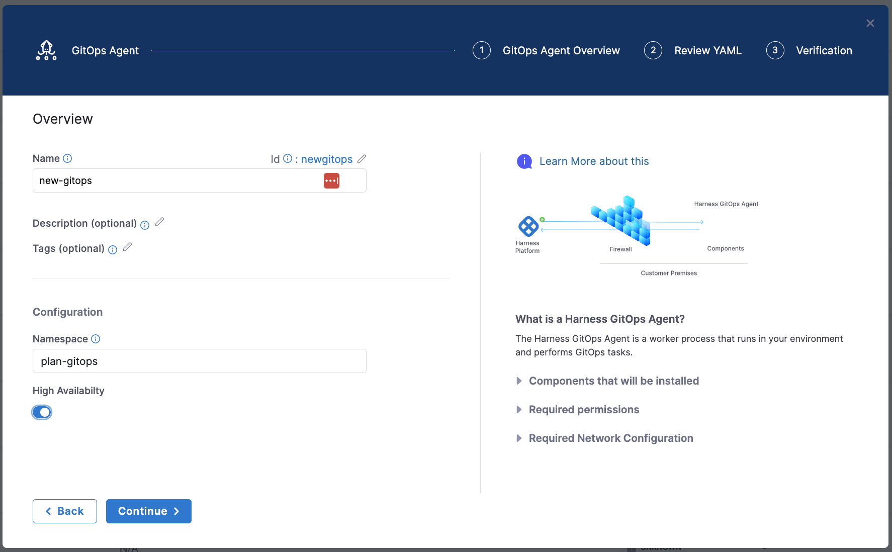
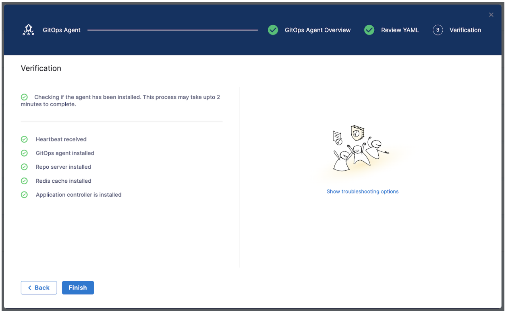
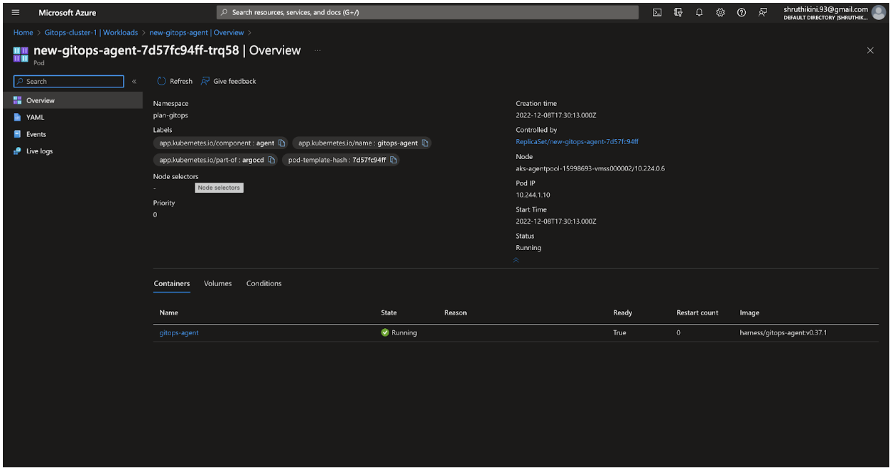

---
slug: Beginners-Step-to-Harness-CD-GitOps
title: "Beginners Step to Harness CD GitOps!"
authors: [Shruthi Kini]
tags: [continuous-delivery, GitOps, Harness, cme]
---

In this blog, let us understand concepts around Harness GitOps and its worker process, GitOps Agent along with the step-by-step installation procedure.

### Introduction to Harness CD GitOps

GitOps is a process of automating Kubernetes-based deployments by syncing Kubernetes manifests in your source repository with your target cluster. Everytime, you want to deploy a new application or update an existing one, you will just need to update the repository and the automated process handles everything where git is the **single source of truth for the infrastructure definitions**. 

Harness GitOps is a complete CD solution with governance, enterprise control, visibility and 100% interoperability with the open-source Argo CD GitOps approach. With GitOps, we can take extensive benefit of declarative specifications. 

### Benefits of Harness GitOps

1. Provides a way to fork features and revert/rollback to keep the desired state.

2. Increased productivity through Continuous Delivery/Deployment.

3. Provides additional visibility.

4. Provides real-time view of application activity and workflows centered.

5. Provides exclusive benefit for organizations to use a single set of tools

You set up Harness GitOps by installing a GitOps Agent in your environment

### Why Harness GitOps and how does it work?

For an enterprise to buy multiple tools for changing software requirements will be a costly venture. GitOps solved this need by providing a one-stop-solution for all DevOps needs. Moreover, GitOps supports some of the popular deployment strategies like Blue/Green deployment, Canary deployment natively as users need.

Harness users will be able to perform deployments via GitOps and pipeline. The project will have a GitOps menu to perform GitOps deployments.

### Installing Harness GitOps Agent

A Harness GitOps Agent is a worker process that runs in your environment and performs GitOps tasks.

First step is setting up an Agent on the target cluster before setting up the Cluster, Repository or Application.

### Prerequisites before installation

* vCPUs, Memory, Disk Size- 1 vCPUs, 2 GB memory, 20GB disk for GitOps Agent though selecting the machine size and other factors depends on Applications and deployed services in your cluster.

* Networking - An Outbound HTTPS connection to **app.harness.io**, **github.com**, **hub.docker.com** and allow TCP port 22 for SSH.

* Kubernetes service account- With permissions needed to create the desired state. Harness GitOps Agent requires **admin** permissions in the target namespace.

* Target **Namespace** must be created in-hand and Harness will not create the namespace.

### Let’s get started!

Step 1: At this point we have created a Kubernetes cluster following the specifications from the prerequisite section. Let us create a namespace that will be used for installing GitOps Agent on the Kubernetes cluster. We have created a namespace **plan-gitops** using command:

```
kubectl get namespaces
```

 

Step 2: Add an Agent
Ensure you are on the **Continuous Delivery** module and click on **GitOps**. This opens Harness GitOps overview, Applications and Settings. 

Now go to **Settings** -> **GitOps Agent** -> **+New GitOps Agent**. You will be prompted for any existing Argo CD instances and you can **enable** ‘High availability’, if required.

 

Step 3: You can review manifest YAML file and either install it locally or on cloud shell on a Kubernetes cluster. Now, you have to run this command 

``` 
kubectl apply -f gitops-agent.yml -n plan-gitops
```

 

Step 4: Once Harness GitOps Agent is installed on the Kubernetes cluster, it indicates that the agent is registered and you can click on **Continue**.
   

Step 5: Once finished the **Agents** list shows the new Agent as **Healthy** and **Connected**.   
 

You can also check the **Kubernetes Cluster Workloads** to see the Agent workload.
 

  

### Next Step?

Feel free to ask questions at [community.harness.io](https://community.harness.io/c/harness/7) or join [community slack](https://join.slack.com/t/harnesscommunity/shared_invite/zt-y4hdqh7p-RVuEQyIl5Hcx4Ck8VCvzBw) to chat with our engineers in product-specific channels like:

[#continuous-integration](https://join.slack.com/t/harnesscommunity/shared_invite/zt-y4hdqh7p-RVuEQyIl5Hcx4Ck8VCvzBw) Ask questions/help other users regarding CI Module of Harness.

[#continuous-delivery](https://join.slack.com/t/harnesscommunity/shared_invite/zt-y4hdqh7p-RVuEQyIl5Hcx4Ck8VCvzBw) Ask questions/help other users regarding CD Module of Harness.
